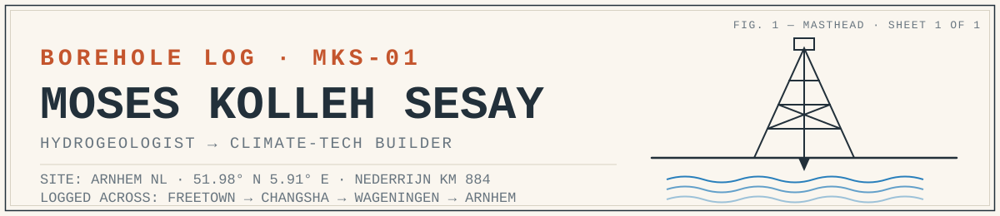
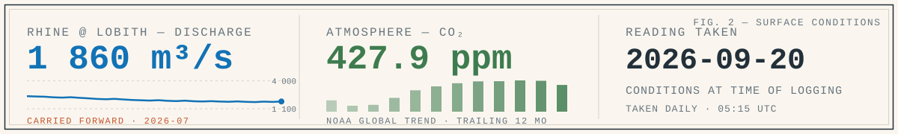
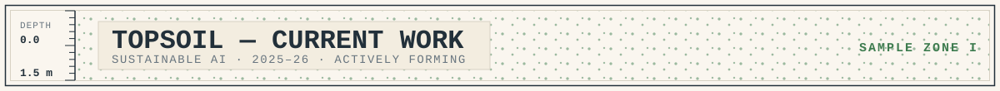
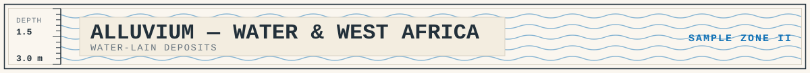
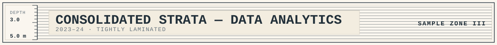
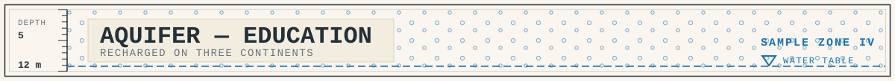
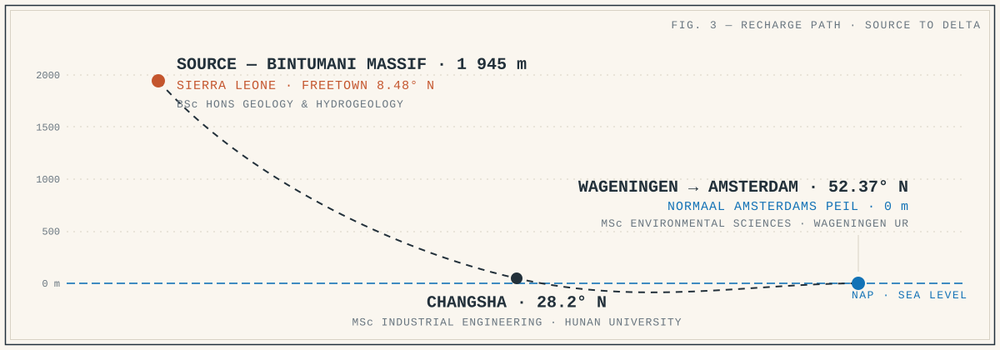
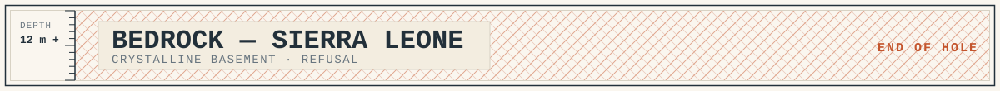

<picture>
  <source media="(prefers-color-scheme: dark)" srcset="assets/header-dark.svg">
  
</picture>

| | |
|---|---|
| **LOGGED BY** | Moses Kolleh Sesay — hydrogeologist → climate-tech builder · Amsterdam, NL |
| **CONTACT** | [moseskollehsesay@gmail.com](mailto:moseskollehsesay@gmail.com) · [LinkedIn](https://www.linkedin.com/in/moseskollehsesay) · [@MosesKolleh](https://x.com/MosesKolleh) · [Portfolio](https://moseskolleh.github.io/sustaintheworld/) |
| **KEY SAMPLES** | [promptcoach](https://github.com/moseskolleh/promptcoach) · [GAIA-Framework](https://github.com/moseskolleh/GAIA-Framework-) · [Maji](https://github.com/moseskolleh/Maji) |
| **METHOD** | Python · SQL · R · GIS (QGIS, ArcGIS, Google Earth Engine) · TypeScript |
| **STATUS** | Open to climate-data / climate-tech roles in NL & EU |

> I read landscapes for a living — first with a rock hammer and a dip meter in Sierra Leone, now with pandas and Google Earth Engine in the Netherlands. A core log records what a place is made of, newest layer first. This is mine. **Drill down.**

`● recording (active)` · `◍ field-validated` · `◌ prototype` · `▣ archived survey`

## Daily readings — the Rhine and the atmosphere

<picture>
  <source media="(prefers-color-scheme: dark)" srcset="assets/surface-conditions-dark.svg">
  
</picture>

> *Two numbers I watch the way other people watch the weather: how much water the Rhine is carrying as it enters the Netherlands (measured at Lobith, the gauge the whole country checks first), and how much CO₂ is in the air. A script logs them here every morning — and because a hydrologist never trusts an undated reading, the panel always shows the date it was taken. [How this works →](scripts/update_surface_conditions.py)*

<picture>
  <source media="(prefers-color-scheme: dark)" srcset="assets/stratum-1-dark.svg">
  
</picture>

## Current work — TOPSOIL · 2025–26 · sustainable AI

The newest layer, still unconsolidated. I build tools that make AI's water and energy costs visible before you spend them.

- ● **[promptcoach](https://github.com/moseskolleh/promptcoach)** — Shows an AI prompt's energy, water, and carbon cost in units you can feel — *"2 teaspoons of water"* — before you hit send, then coaches you to shrink it. `SAMPLE PC-77 · JS monorepo · Chrome MV3 · tested core engine · 19-model catalog`

  

Extended sample notes

  A zero-dependency core engine estimates per-token energy from published 2025–26 benchmarks (Google, OpenAI, Epoch AI, Microsoft, Jegham et al.), with every formula and source cited in [METHODOLOGY.md](https://github.com/moseskolleh/promptcoach/blob/main/docs/METHODOLOGY.md). Ships as a Chrome extension that injects a live eco-grade pill into ChatGPT, Claude, Gemini and six other AI chat surfaces, plus a no-build web app. EU-energy-label-style A–E grades; 13 passing engine tests. Grew out of the prototype that won partner validation at the Ministry of Finance project below.

  

- ● **[GAIA-Framework](https://github.com/moseskolleh/GAIA-Framework-)** — A dashboard that grades 18+ AI models from A+ to F on energy, water, and carbon so teams can choose greener deployments. `SAMPLE GA-60 · vanilla JS · zero dependencies · CSV export`

- ◍ **[SustainableAIPrototypes](https://github.com/moseskolleh/SustainableAIPrototypes)** — Behavior-change prototypes built with the Dutch Ministry of Finance (via Digital Society School) that turn invisible AI carbon into feedback people act on. `SAMPLE SP-33 · partner-validated fieldwork`

  

Extended sample notes

  Five prototypes tested with a real government partner: a prompt coach with department dashboard (the partner-validated winner), a "Magic Mirror" ambient display, a Tetris-style usage visualizer, a digital carbon forest, and a browser extension. The repo carries the field research itself — partner feedback, research decks, and build guides — because prototypes without evidence are just demos.

  

<picture>
  <source media="(prefers-color-scheme: dark)" srcset="assets/stratum-2-dark.svg">
  
</picture>

## Water & West Africa — ALLUVIUM · water-lain

Everything I build eventually finds its way back to water. *Maji* is Swahili for it.

- ◌ **[Maji](https://github.com/moseskolleh/Maji)** — A mobile-first, offline-capable platform for Freetown's informal water economy: crowdsourced supply alerts from paid Water Scouts, a vendor marketplace on Orange Money and Africell mobile money, and a live PostGIS water-point map. Offline-first, because the network fails exactly when the taps do. The problem I grew up next to, built with the stack I have now. `SAMPLE MJ-07 · TypeScript · Fastify + PostGIS + Prisma · React Native · early-stage`

- ◌ **[climatematchProjects](https://github.com/moseskolleh/climatematchProjects)** — A five-proposal research program design (€2.6M scope) for African climate resilience: drought early warning, hybrid physics-ML flood prediction, and coastal compound risk. `SAMPLE CM-14 · research design`

<picture>
  <source media="(prefers-color-scheme: dark)" srcset="assets/stratum-3-dark.svg">
  
</picture>

## Data analytics — CONSOLIDATED STRATA · 2023–24

The layer everything above stands on: statistics done carefully enough to say no.

- ▣ **[A/B Testing at GloBox](https://github.com/moseskolleh/A-B-Testing-at-Globox)** — SQL → Python statistics → Tableau, ending in the rarest analyst deliverable: a well-argued recommendation *not* to ship a feature that lifted conversion but not revenue. Novelty effects said wait. `SAMPLE GB-38 · full report + Tableau dashboard`

- Google Advanced Data Analytics Professional Certificate — regression and machine learning on real business cases (Automatidata, TikTok, Waze).

<picture>
  <source media="(prefers-color-scheme: dark)" srcset="assets/stratum-4-dark.svg">
  
</picture>

## Education — AQUIFER · recharged on three continents

An aquifer stores what the surface forgets. Mine was recharged in Freetown, Changsha, and Wageningen.

| Degree | Institution |
|---|---|
| MSc Environmental Sciences — Human–Environment Interaction | Wageningen University & Research, NL |
| MSc Industrial Engineering | Hunan University, CN |
| BSc Honours Geology — Hydrogeology | University of Sierra Leone, SL |

<picture>
  <source media="(prefers-color-scheme: dark)" srcset="assets/drill-path-dark.svg">
  
</picture>

<picture>
  <source media="(prefers-color-scheme: dark)" srcset="assets/stratum-5-dark.svg">
  
</picture>

## Bedrock — SIERRA LEONE

> Basement rock: Freetown, Sierra Leone — where I first learned that water is never abstract. It's about who can reach it, and when. Everything above sits on this. If you're building for climate, water, or the places data usually skips, my inbox is open.

---

`END OF LOG · TOTAL DEPTH: ONE CAREER, STILL DRILLING`

[moseskollehsesay@gmail.com](mailto:moseskollehsesay@gmail.com) · [LinkedIn](https://www.linkedin.com/in/moseskollehsesay) · [Portfolio](https://moseskolleh.github.io/sustaintheworld/)

